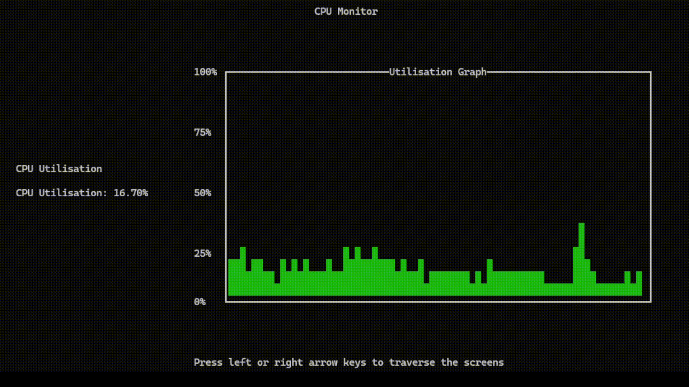
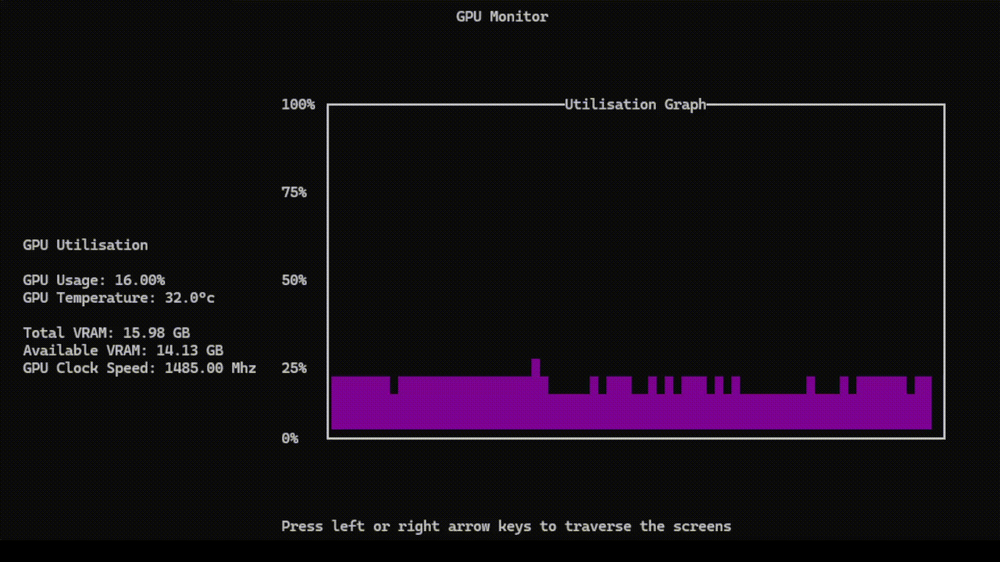
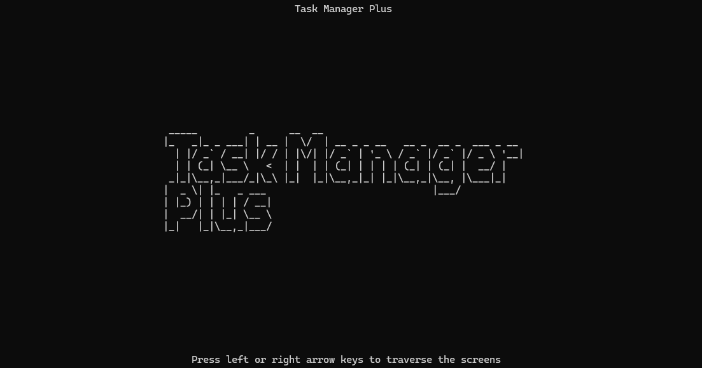

# Task Manager Plus

## Overview
Monitoring tool used to graph utilisation % of system components and track key metrics. 

## Features
- Real-time history graph of hardware utilisation
- Multithreaded
- Real-time metrics for hardware

## Motivation
My motivation for this was largely just for fun but also some curiosity about hardware monitoring.

## 3rd Party Tools / APIs
- ADLX
- Ncurses (PDcurses)
- NVML
- OpenCL

## Prerequisites
It's assumed that you have the following prior to running the application:
- AMD GPU OR NVIDIA GPU
- CPP Compiler
- Windows OS
- Visual Studio OR CMake

## How To Run
NOTE: For NVIDIA GPU install the CUDA toolkit here: https://developer.nvidia.com/cuda-downloads

### Visual Studio
Visual Studio - AMD GPU:
- Open the .sln
- Click green play button

Visual Studio - NVIDIA GPU:
- Open the .sln
- Right click on TaskManagerPlus -> Properties
- C/C++ -> General -> Additional Include Directories -> Path to CUDA include directory
- C/C++ -> Preprocessor -> Preprocessor Definitions -> Rename 'USE_AMD' to 'USE_NVIDIA'
- Linker -> General -> Additional Library Directories -> Path to CUDA lib x64 directory
- Linker -> Input -> Additional Dependencies -> nvml.lib
- Click green play button
  
### CMAKE
NVIDIA GPU: Add path to CUDA include directory under 'target_include_directories' || Add path to nvml.lib located in CUDA lib x64 directory under 'target_link_libraries'

Cmake - MSVC
- cd to project directory where CMakeLists.txt is located
- cd build
- cmake .. -G "Visual Studio 17 2022" -DUSE_AMD=ON (for AMD GPU)
- cmake .. -G "Visual Studio 17 2022" -DUSE_AMD=OFF (for NVIDIA GPU)
- cmake --build . --config Release
- Run the .exe located in build/Release

Cmake - MinGW
- cd to project directory where CMakeLists.txt is located
- cd build
- cmake .. -G "MinGW Makefiles" -DUSE_AMD=ON (for AMD GPU)
- cmake .. -G "MinGW Makefiles" -DUSE_AMD=OFF (for NVIDIA GPU)
- cmake --build .
- Run the .exe in build/

The application should run fine, if there issues running the project contact me via email.

## Examples

### CPU Monitoring

### GPU Monitoring

### Home Screen

---
